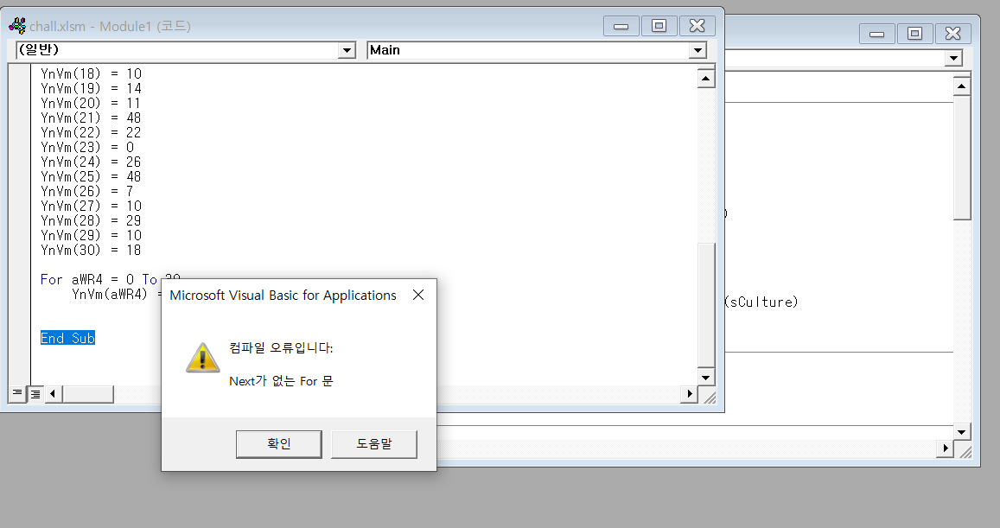
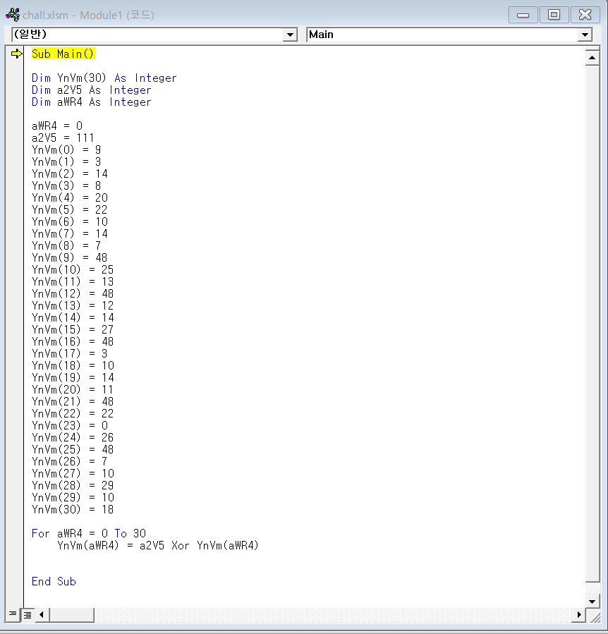

# vbcat
- - - -
* main

문제파일을 받아보니 xlsm 형식이고, 유형에 매크로 사용워크시트 라고 한다. 파일을 열어보니 위의 사진처럼 그림이 나왔다. 바로 매크로에 들어가보았다.

* macro

main이라는 이름의 매크로가 들어있어서 실행을 했다.

* macro_2

컴파일에러가 발생했는데 에러가 발생한 부분의 코드를 자세히 보니 어떤 값들을 들어가 있는 변수가 있다.

* code

코드를 자세히 보니 입력한 변수들과 111을 xor연산을 해서 다시 저장하고 있다. 아마도 연산후의 값을 구하는 것으로 보인다. 위 코드를 python으로 옮겨서 실행을 해보았다.

## payload
- - - -
```
YnVm = [9, 3,14,8,20,22,10,14,7,48,25,13,48,12,14,27,48,3,10,14,11,48,22,0,26,48,7,10,29,10,18]


for i in range(31):
    YnVm[i] = 111 ^ YnVm[i]


s=""
for i in range(31):
    s+=chr(YnVm[i])
print (s)
```


## flag
- - - -
flag{yeah_vb_cat_lead_you_here}


#CTF/IGRUS/misc