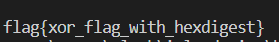

# babyelf
- - - -
문제파일로 babyelf 와 output 파일을 받았다. babyelf를 열어보았다.
* main


key값을 입력한 값과 xor연산을 하는 것을 볼 수 있었다.
* key


key값을 추적해보니 8개의 값이 들어 있고 이를 순서대로 xor연산을 해서 output을 만들었다는걸 알 수 있다.
xor연산의 특징은 xor한 값에 다시 xor연산을 하면 원래의 값으로 돌아온다는 것이다. output에 다시 key값과 xor연산을 하면 input의 값을 알 수 있다. 그래서 python으로 코드를 만들어 실행시켰다.


## payload
- - - -
```
ind=[0xd8, 0xd6, 0x9f, 0xad, 0x94, 0xc6, 0xc2, 0xac, 0xe1, 0xdc, 0x92, 0xab, 0x88, 0xe1, 0xda, 0xb7, 0xca, 0xd2, 0xa1, 0xa2, 0x8a, 0xc6, 0xc9, 0xb7, 0xd9, 0xdf, 0x8d, 0xbe, 0x92]

key=[0xbe, 0xba, 0xfe, 0xca, 0xef, 0xbe, 0xad, 0xde]

dest=''

s=""
print(dest)
for i in range(len(ind)):
    d =ind[i]  ^ key[i%8]
    s+=chr(d)
print (s)

```


## flag
- - - -


#CTF/IGRUS/rev