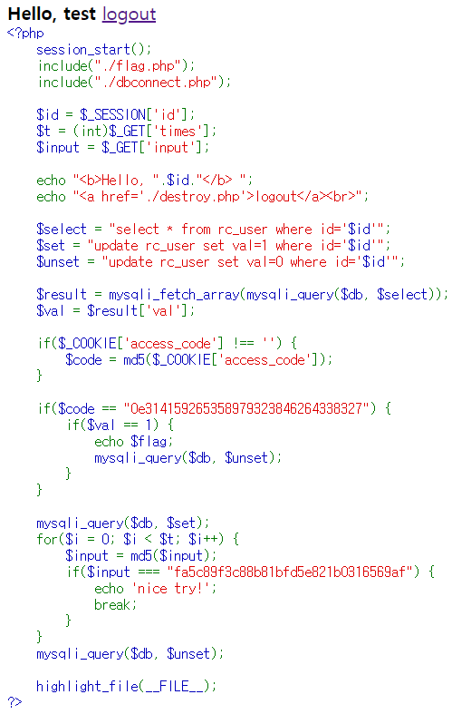
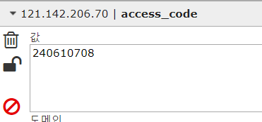

# rc_car
- - - -
문제 사이트에 들어가니 아이디를 만들라고 해서 test라는 이름으로 만들었다.

* index.php

로그인을 했더니 php 코드가 보였다. `echo $flag`를 출력하게 하면 되는 문제이다.
코드를 자세히 보면 `$_COOKIE['access_code']`로 받은  값을 md5로 암호화 하여`$code`에 넣고 이 값이 `0e314159265358979323846264338327`과 같고, `$val`이 1이면 `echo $flag`를 실행시킨다.
우선 `$code`의 조건문이 `0e`로 시작하고, 비교 연산자가 `==`이기에  access_code에 넣을 값은 magic hash인 '240610708'이다. 다음은 $val인데 처음 가입했을때엔 어떤 값이 들어 있을지는 몰라도 `if ($code == "0e314159265358979323846264338327"` 부분을 지나면 `mysqli_auery($db, $set`으로 val의 값을 1로 만들고 있다. 그다음 get으로 받은 time만큼 반복문을 반복 하고, 다시 val을 0으로 만든다. 즉 time에 큰 값을 넣고 for문을 반복하는 동안에 다른 브라우저로 접속을 시도하면 된다.

payload
- - - -
* set_cookie

* exploit&flag

#CTF/IGRUS/web