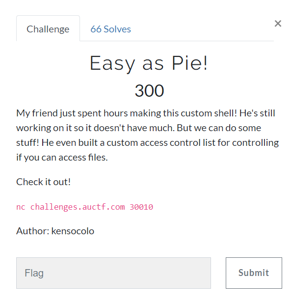

# ease_as_pie
- - - -
* prob

접속해보서 목록을 보니 acl.txt, user.txt, flag.txt 이렇게 3개의 파일이 있다.
cat flag를 바로 입력해보면 권환이 없어서 읽을 수가 없는데 acl을 읽어 보니 각 파일의 권한에 대한 설정이 들어있다.
처음에 적혀있는 것처럼 help를 입력해보니 명령어가 cat, help, ls, write 밖에 없다.
write를 이용해야 될것 같아서 help write를 해보니 입력한 내용을 파일의 앞에 추가한다고 적혀있다.
즉 acl.txt에 flag.txt의 권한을 user권한으로 설정 후 읽으면 될것 같다.
`write flag.txt:user:600 acl.txt`
를 입력 후 flag를 읽어보니 flag가 출력 됬다.

#CTF/auctf/pwn