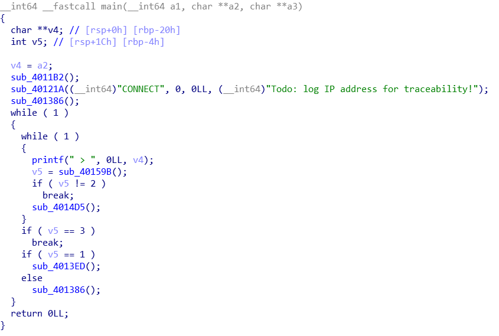
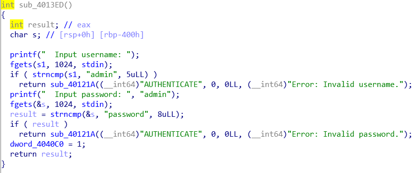
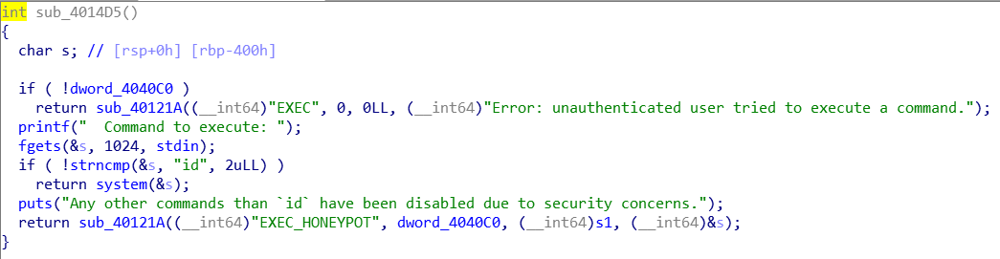
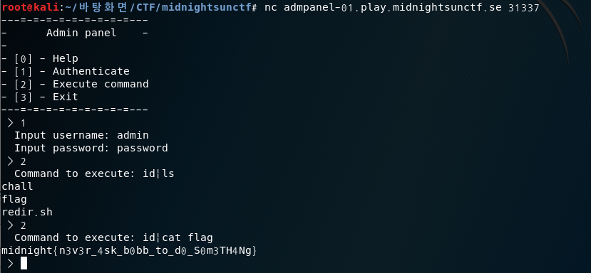

# admpanel
- - - -
* main

메뉴를 출력하고 0~3까지의 입력을 받는 부분이다. 딱히 뭐 없으니 인증부분을 보자

* auth

id에 admin, pw에 password를 입력하면 인증이 완료된다. 특이한 점은 입력은 1024바이트를 받는데 if에서는 admin, password가 입력값 앞에 있는지만 확인한다.
일단 넘어가고....

* command

문제는 이 부분이다.
system함수를 call하는데 입력한 값이 id 인지 확인해서 맞으면 입력값을 system함수의 인자로 넘겨준다.
하지만 여기서 문제점은 입력값을 검사 할 때 2byte만 검사를 진행한다. 즉 입력값이 무엇이든 앞에 id만 들거가면 통과한다는 점이다. 그래서 `id | ls` 등의 파이프라인을 써서 확인해보니 flag가 있었고, `id | cat flag` 를 통해 flag를 읽었다.

#CTF/midnightsunctf/pwn

